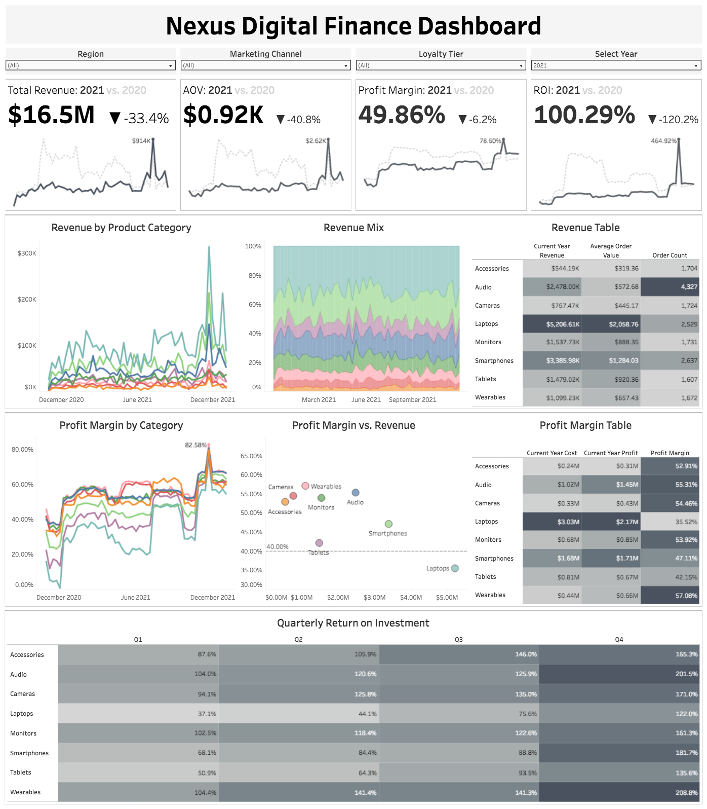
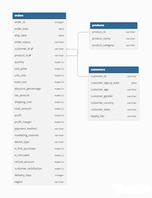

# Nexus Digital Portfolio Optimization Analysis

## Background
Nexus Digital is a global consumer electronics e-commerce company operating across 10 countries in North America, Europe, Asia-Pacific, and Latin America. The company offers 21 products across 8 categories (Laptops, Smartphones, Tablets, Audio, Wearables, Cameras, Monitors, and Accessories) and has served approximately 25,000 unique customers between 2018 and 2023, generating $125.9M in total revenue across 103,000 transactions.

The Finance and Product teams have requested recommendations on which products to prioritize, which to discontinue, and how to optimize inventory allocation to increase overall profit margin by 3-5 percentage points.

The following Key Performance Indicators (KPIs) will be used to evaluate sales performance in this analysis:
- **Revenue**: Total dollar value of transactions
- **Return on Investment (ROI)**: Profit relative to total cost invested, expressed as a percentage
- **Profit Margin**: Profit as a percentage of revenue, measuring operational efficiency
- **Average Order Value (AOV)**: Mean transaction size, indicating customer spending behavior
- **Quarterly Performance Trends**: Time-series analysis of revenue and profitability patterns

---

## Executive Summary
### Finance Team
- Smartphones deliver the highest ROI at 176% but experienced margin compression from 74% (Q4 2019) to 62% (2020-2022) before recovering to 73% (Q4 2023), presenting a strategic opportunity to capitalize on normalized margins
- Accessories category generates only 105% ROI—below the 143% portfolio average—with declining performance from 265% ROI (Q2 2020) to 133% ROI (Q4 2023), indicating potential discontinuation candidates
- Revenue concentration risk: Laptops (41%), Smartphones (22%), and Tablets (11%) comprise 74% of total revenue, meaning portfolio decisions in these categories have an outsized impact on company performance

### Product Team
- Macro-economic events significantly disrupted traditional seasonality: COVID-19 pandemic reversed seasonal patterns with Spring 2020 revenue ($3.25M) exceeding Black Friday 2020 ($1.7M), while chip shortage (2021) and inflation (2022) caused category-wide revenue contractions of 18-52% vs. pre-pandemic baseline
- Black Friday/Holiday season drives 2-2.5x revenue uplift for Smartphones across all regions, while Spring sales generate 2.4x uplift for Monitors and Back-to-School drives 2.2-2.4x uplift for Tablets/Laptops in Latin America, indicating clear inventory allocation priorities by season and geography
- Audio category shows volatile performance with Q1 post-holiday crashes (52% ROI, Q1 2022) following strong holiday periods (195% ROI, Holiday 2021), suggesting aggressive holiday discounting damages profitability and warrants inventory strategy reassessment

An interactive Tableau dashboard highlighting these findings can be downloaded [here](tableau/dashboard/nexus_digital_finance_dashboard.twbx).

|  |
|---|

---
## Data Structure Overview

The Nexus Digital book of business contains 103,000 records with approximately 25,000 unique customers. This dataset covers data from 2018 to 2023.

After initial data cleaning in Excel, SQL was used to perform final cleaning and prepare the data for dashboard creation. 

A Data Dictionary for this dataset can be found [here](excel/nexus_digital_data_dictionary.xlsx)

An Issues Log containing data quality issues found in the original dataset can be found [here](excel/nexus_digital_issues_log.xlsx)

SQL queries used to create the data structure and prepare it for the dashboard can be found [here](sql/ddl).

SQL queries used to perform data quality checks can be found [here](sql/quality_checks)

Below is an Entity Relationship Diagram (ERD) showing how the data is structured after cleaning.

|  |
|---|
---

## Key Findings and Insights

### Finance Team

#### Revenue Performance
*Initial Findings*
  - Total revenue across 2018-2023 reached $125.9M, with monthly revenue climbing to a November 2019 peak of $3.6M before declining to a near-historical low of $0.9M in January 2021, followed by a gradual recovery to a historical high of $4.4M in December 2023
  - Laptops comprise 41% of total revenue, Smartphones 22%, and Tablets 11%; all other categories contribute less than 10% individually, creating significant concentration risk where strategic decisions in the top three categories have an outsized portfolio impact
  - Three distinct seasonal revenue periods emerged: Spring (March/April), Back-to-School (August/September), and Black Friday/Holiday (November), with exceptions during Q1 2020 (COVID outbreak) and Q4 2020 (supply chain disruptions)

*Deep Dive Findings*
  - 2020 pandemic reversed traditional seasonality patterns: Spring revenue reached $3.25M and Back-to-School $2.62M compared to Black Friday/Holiday $1.7M—a complete inversion of historical patterns where BF/H typically generates 50-100% higher revenue than other seasonal periods
  - Compared to the pre-pandemic baseline, 2020 Laptop revenue grew 24% (driven by Business Notebook in Asia-Pacific at 140% and Gaming Laptop RTX in North America at 141%), while all other categories contracted: Tablets -63%, Audio -63%, Smartphones -62%, Wearables -61%
  - 2023 performance recovered to 95-102% of pre-pandemic baseline across all categories, with Latin America showing exceptional growth in Smart Speaker (147%), Smartphone Budget (140%), and Smart Watch Pro (153%)

#### Return on Investment (ROI)
*Initial Findings*
  - Smartphones deliver the highest category ROI at 176%, while Audio and Accessories deliver the lowest at 106% and 105% respectively, indicating significant performance dispersion across the portfolio
  - Macro events had measurable impacts on ROI: Trade War, Chip Shortage, and Inflation/Recession created depressive effects, while Tech Boom (2019) and 2023 Economic Recovery provided uplift; COVID-19 Pandemic had the most significant impact, fundamentally disrupting seasonal ROI patterns

*Deep Dive Findings*
  - Smartphones reached a historical ROI peak of 350% with 74% profit margin in Q4 2019 (generating $2.43M revenue), declined to 200% ROI/62% margin during 2020-2022 holidays (with revenue contracting to $1.4M), bottomed at 65% ROI/37% margin in Q1 2021 (chip shortage), then recovered to 320% ROI/73% margin by Q4 2023
  - Accessories entered product line in Q1 2020 with strong Q2 performance (265% ROI, 46% margin, $0.21M revenue) but experienced steep decline to 74% ROI/38% margin/$0.11M revenue by Q4 2022, with historical low of 44% ROI/28% margin in Q1 2022; partial recovery to 133% ROI/54% margin by Q4 2023 remains below portfolio average of 143%
  - 2021 Chip Shortage caused category-wide revenue contraction vs. baseline: Tablets -52%, Smartphones -45%, Laptops -45%, Wearables -21%; Audio was the sole growth category at 104% vs. baseline, with Smart Speaker in Latin America delivering an exceptional 207% uplift

#### Profit Margin
  - Audio category demonstrates volatile margin performance: Q1 post-holiday crashes to 59% margin (Q1 2022) following strong holiday periods of 65% margin (Holiday 2021), suggesting an aggressive holiday discounting strategy damages subsequent quarter profitability
  - Holiday 2019 and 2021 represented Audio's peak performance at $0.85M revenue/195% ROI/65% margin, followed by Q1 2022 collapse to $0.43M revenue/52% ROI/59% margin and weak Holiday 2022 of $0.57M revenue/104% ROI/46% margin—indicating a systematic post-holiday margin compression pattern
  - 2022 Inflation/Recession period saw all categories perform 74-82% vs. pre-pandemic baseline, with Wearables worst affected (74%) and Smartphones most resilient (82%); notably, all categories below 70% in 2021 showed recovery signs in 2022

### Product Team

#### Average Order Value (AOV) & Seasonal Performance
*Initial Findings*
  - AOV shows consistent Q4 spikes annually, with Laptops demonstrating the highest lifetime AOV (~$9.1K in Q1 2020 peak, ~$3.2K lifetime average)
  - While Laptops have the highest absolute AOV, Smartphones show the greatest seasonal uplift, particularly in Q4 (190% vs. baseline), followed by Audio (168%) and Tablets (160%); Laptops demonstrate 157% Q4 uplift
  - Black Friday/Holiday uplift varies by category: Smartphones/Audio/Wearables achieve strongest BF/H performance (~2x, ~1.7x, ~1.6x), while Monitors/Cameras/Accessories/Laptops peak during Spring sales (~2.1x, ~1.9x, ~1.8x, ~1.8x); only Tablets perform best in Back-to-School (~1.59x), though by minimal margin (0.04%)

*Deep Dive Fidings*
  - Black Friday revenue is predominantly driven by Smartphones (1.9-2.5x uplift) across all regions, with Smartphone Budget in Europe (2.4x) and Smartphone Ultra in Latin America (2.5x) providing the greatest uplift
  - Back-to-School revenue concentrated in Tablets/Laptops in Latin America (2.4x and 2.2x), Tablets in Asia-Pacific (1.9x), and Bluetooth Speakers in Latin America (1.9x)
  - Spring sales carried primarily by Monitors in Asia-Pacific/Europe (2.4x), with significant outliers: Wireless Gaming Mouse in Latin America (3.6x) and Action Camera 4K in Latin America (3.4x)

#### Quarterly Performance & Macro-Event Impact
  - Spring and Back-to-School revenue spikes ($1.2-2.5M) are consistently smaller than Black Friday/Holiday spikes ($2.3-4.4M) across 2018, 2019, 2021-2023; 2020 reversed this with Spring $3.25M and B2S $2.62M exceeding BF/H $1.7M—representing a complete seasonal pattern inversion
  - Monitors, Accessories, and Cameras (collectively 11% of revenue) were introduced in Q1 2020 with no pre-pandemic baseline for comparison, limiting historical trend analysis but representing recent portfolio diversification efforts
  - 2023 recovery brought all products to 95-102% of the pre-pandemic baseline, indicating a return to normalized market conditions and a potential opportunity for strategic portfolio optimization without macro-economic headwinds

---
## Recommendations

### Finance Team: Portfolio Rationalization
- **Discontinue underperforming Accessories products**
  - Accessories deliver 105% ROI vs. 143% portfolio average, with declining trajectory from 265% ROI (Q2 2020 launch) to 133% (Q4 2023)
  - Accessories represent minimal revenue contribution (<10%) with consistent underperformance vs. baseline
  - Estimated margin improvement: +0.8pp through elimination of negative-margin inventory carrying costs
- **Reallocate inventory investment to Smartphones for Q4 2024**
  - Smartphones deliver the highest category ROI (176%) with recovered margins (73% in Q4 2023, near historical peak of 74%)
  - Q4 seasonal uplift of 190% vs. baseline and consistent 1.9-2.5x Black Friday performance across all regions
  - Recommend doubling Q4 smartphone inventory allocation vs. historical levels
  - Projected impact: +$180K additional profit in Q4 2024, +1.2pp margin contribution
- **Implement tiered portfolio management strategy based on revenue concentration**
  - Top 3 categories (Laptops 41%, Smartphones 22%, Tablets 11%) represent 74% of revenue
  - Prioritize margin optimization in these categories over lower-contribution products
  - Establish a minimum ROI threshold of 150% for continued product investment; phase out products consistently below this benchmark

### Product Team: Inventory & Seasonal Strategy
- **Reduce Audio product inventory 60% in Q1, maintain minimal stock until Q3**
  - Audio demonstrates systematic post-holiday margin collapse: 65% margin (Holiday 2021) → 59% margin (Q1 2022), indicating aggressive holiday discounting followed by clearance sales
  - Q1 inventory reduction eliminates margin-destroying clearance cycle
  - Estimated impact: +0.5pp margin improvement through reduced Q1 carrying costs and avoided clearance discounting
- **Develop region-specific seasonal inventory strategies**
  - Black Friday: Prioritize Smartphone inventory in all regions (2-2.5x uplift), particularly Smartphone Budget (Europe) and Smartphone Ultra (Latin America)
  - Back-to-School: Allocate Tablets/Laptops to Latin America (2.2-2.4x uplift), Tablets to Asia-Pacific (1.9x)
  - Spring Sales: Stock Monitors in Asia-Pacific/Europe (2.4x uplift)
  - This targeted allocation maximizes capital efficiency by matching inventory to demonstrated regional seasonal demand patterns
- **Establish macro-event contingency protocols**
  - 2020-2022 demonstrated significant volatility: pandemic reversed seasonality, chip shortage contracted revenue 18-52%, inflation reduced performance 18-26% vs. baseline
  - Implement quarterly scenario planning with inventory flexibility provisions (supplier return options, flexible payment terms)
  - Maintain 15% buffer inventory for high-ROI categories (Smartphones, Laptops) to capitalize on unexpected demand surges while limiting downside exposure
